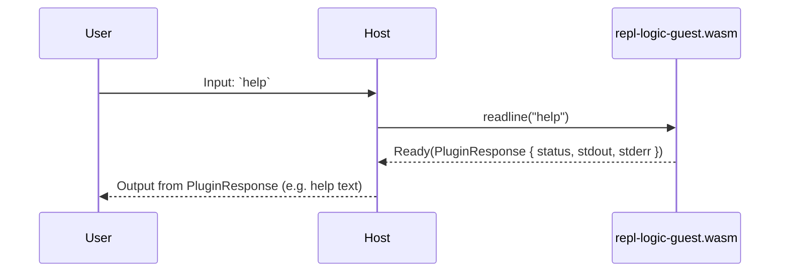
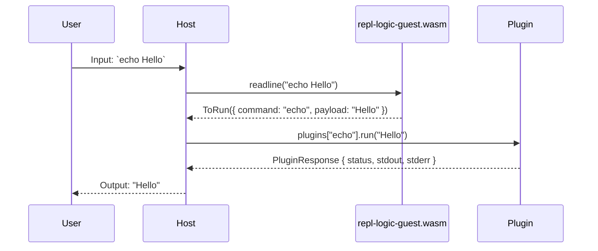

# Reserved commands

```mermaid
sequenceDiagram
  participant User
  participant Host
  participant repl-logic-guest.wasm

  User->>Host: Input: `help`
  Host->>repl-logic-guest.wasm: readline("help")
  repl-logic-guest.wasm-->>Host: Ready(PluginResponse { status, stdout, stderr })
  Host-->>User: Output from PluginResponse (e.g. help text)
```

# Plugins

```mermaid
sequenceDiagram
  participant User
  participant Host
  participant repl-logic-guest.wasm

  User->>Host: Input: `echo Hello`
  Host->>repl-logic-guest.wasm: readline("echo Hello")
  repl-logic-guest.wasm-->>Host: ToRun({ command: "echo", payload: "Hello" })
  Host->>Plugin: plugins["echo"].run("Hello")
  Plugin-->>Host: PluginResponse { status, stdout, stderr }
  Host-->>User: Output: "Hello"
```
