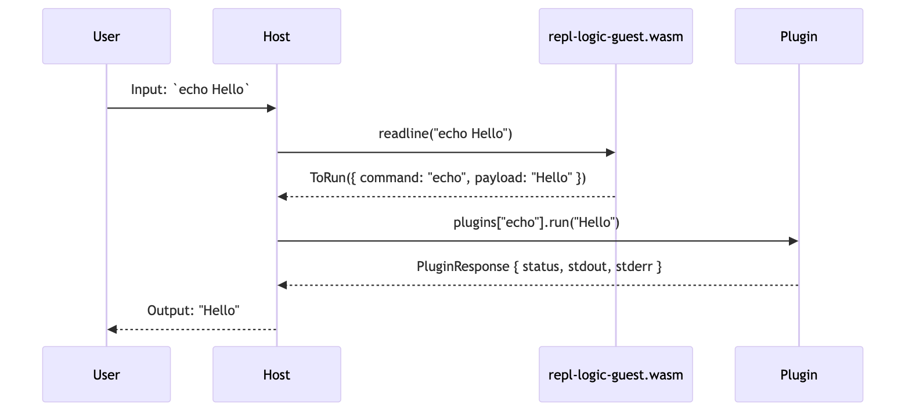
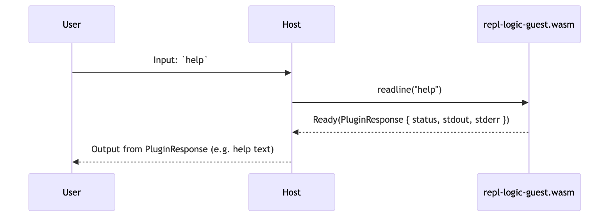

---
# You can also start simply with 'default'
theme: apple-basic
# random image from a curated Unsplash collection by Anthony
# like them? see https://unsplash.com/collections/94734566/slidev
background: https://cover.sli.dev
# Global CSS file
# css: style.css
# Alternative: inline global styles
# css: |
#   body { font-family: 'Inter', sans-serif; }
#   h1 { color: #2d3748; font-weight: 700; }
# some information about your slides (markdown enabled)
title: Construire un système de plugins basé sur le WebAssembly Component Model
info: Découvrez WebAssembly Component Model à travers un projet de repl shell cross-platform.
# apply unocss classes to the current slide
class: text-center
# https://sli.dev/features/drawing
drawings:
  persist: false
# slide transition: https://sli.dev/guide/animations.html#slide-transitions
transition: slide-left
# enable MDC Syntax: https://sli.dev/features/mdc
mdc: true
# open graph
seoMeta:
  # By default, Slidev will use ./og-image.png if it exists,
  # or generate one from the first slide if not found.
  ogImage: https://repository-images.githubusercontent.com/1002449116/0a05d77e-271c-408d-beb1-e9e48711d1c6
favicon: https://topheman.github.io/favicon.ico

---

# WebAssembly Component Model 🧩

<p class="flex justify-center"  >

</p>

## [topheman/webassembly-component-model-experiments](https://github.com/topheman/webassembly-component-model-experiments)

## Christophe Rosset - [@topheman](https://topheman.github.io/me/)

<!--

Qui a entendu parler de WebAssembly ?

Qui a entendu parler de WebAssembly Component Model ?

Bonsoir, je suis Christophe Rosset, je travaille dans le développpement web, surtout sur du TypeScript/React/NodeJS et pas mal de rust à titre personnel.

Il y a 7 ans, j'ai découvert Rust en faisant du WebAssembly, c'était à l'époque le seul langage avec un support correct.

Ce soir je vais vous parler de WebAssembly Component Model, ceci au travers de mon dernier projet en rust.

-->

---
layout: center
class: text-center
---

# 🎯 Pourquoi ce projet ?

Exemples de projets avec WebAssembly Component Model **trop simples** ou **trop complexes**

**But**: Montrer une application concrète

---

# 🔄 L'évolution de WebAssembly

## WebAssembly → WASI → Component Model

- **WebAssembly** : Format binaire portable, secure by default, performance proche du natif
- **WASI (WebAssembly System Interface)** :
  - Interface système standardisée pour WebAssembly, inspirée de POSIX, permettant l'accès sécurisé aux ressources système (filesystem, réseau ...)
- **Component Model** :
  - Composition et interopérabilité des modules via des types et interfaces haut niveau (WIT)

---
layout: center
class: text-center
---

# 🎬 Démo :

- REPL (Read-Eval-Print Loop)
- Chaque commande est un composant WebAssembly

```bash
cargo install pluginlab
```

```bash
brew install topheman/tap/pluginlab
```

---

# 🏠 Hosts

- 🔧 CLI
- 🌐 Web

---
transition: fade
---

# 🏠 Host Runtime : CLI 🔧

- Host: **Rust** → **Binaire Cli**
- Components: Rust, C, Go, TypeScript ... → **WebAssembly Components**

<div class="flex justify-center">

</div>

---

# 🏠 Host Runtime : CLI 🔧


<v-switch>
<template #1>
<div class="host-runtime-description computer">
  <p>Le REPL tourne dans un terminal.</p>
</div>
<div class="rect" style="left: 290px;width: 140px;height: 38px;top: 130px;" data-label="terminal"></div>
</template>
<template #2>
<div class="host-runtime-description rust">
  <p>Le CLI est compilé depuis rust vers du natif.</p>
  <p>C'est le binaire <code>pluginlab</code>.</p>
</div>
<div class="rect" style="left: 80px;width: 185px;height: 38px;top: 165px;" data-label="host-cli"></div>
</template>
<template #3>
<div class="host-runtime-description rust">
  <p><code>tokio</code> est utilisé pour le runtime async.</p>
</div>
<div class="rect" style="left: 105px;width: 205px;height: 38px;top: 205px;" data-label="asyncruntime-tokio"></div>
</template>
<template #4>
<div class="host-runtime-description rust">
  <p><code>wasmtime</code></p>
  <p>Runtime WebAssembly.</p>
  <p>Responsable de l'instanciation et l'exécution des composants WebAssembly.</p>
</div>
<div class="rect" style="left: 135px;width: 318px;height: 38px;top: 285px;" data-label="wasmtime"></div>
</template>
<template #5>
<div class="host-runtime-description rust">
  <p><code>wasmtime</code></p>
  <p>Configuration du sandboxing filesystem.</p>
  <p><a href="https://github.com/topheman/webassembly-component-model-experiments/blob/master/crates/pluginlab/src/engine.rs#L115" target="_blank"><code>WasiCtxBuilder::preopened_dir</code></a></p>
  <p>Contrôlé par les flags passés au CLI:</p>
  <pre><code>    --allow-read
    --allow-write
    --allow-all</code></pre>
</div>
<div class="rect" style="left: 135px;width: 318px;height: 38px;top: 285px;" data-label="wasmtime"></div>
<div class="rect" style="left: 471px;width: 188px;height: 70px;top: 372px;" data-label="wasmtime-fs-sandbox"></div>
</template>
<template #6>
<div class="host-runtime-description wasm" style="font-size: 70%; width: 290px;">
  <p><code>repl-logic-guest.wasm</code></p>
  <p><strong>Rôle:</strong> Orchestre les entrées utilisateur.</p>
  <p><strong>Responsabilités:</strong></p>
  <ul>
    <li>Parsing des commandes utilisateur</li>
    <li>Commandes réservées (<code>help</code>, <code>man</code>, <code>export</code>)</li>
  </ul>
  <p>Réutilisation du code entre CLI et navigateur (cohérence du minishell entre les plateformes).</p>
</div>
<div class="rect" style="left: 155px;width: 211px;height: 38px;top: 318px;" data-label="repl-logic"></div>
</template>
<template #7>
<div class="host-runtime-description wasm" style="font-size: 70%; width: 290px;">
  <p><code>plugin*.wasm</code></p>
  <p>Chaque commande (<code>echo</code>, <code>ls</code>, <code>cat</code>, <code>tee</code> ...) est un plugin.</p>
  <p>Chaque plugin est un composant WebAssembly.</p>
  <p>Compilé depuis Rust, C, Go, TypeScript.</p>
  <p>Tous les plugins respectent la même interface WIT.</p>
</div>
<div class="rect" style="left: 155px;width: 141px;height: 128px;top: 357px;" data-label="plugins"></div>
</template>
<template #8>
<div class="host-runtime-description wasm" style="font-size: 70%; width: 290px;">
  <p><code>plugin*.wasm</code> 📁</p>
  <p>Les appels <code>std::fs::*</code> sont routés par l'instance de <code>wasmtime</code> vers le filesystem de l'hôte en respectant les contraintes de sécurité configurées au démarrage.</p>
  <p><strong>#WASI</strong></p>
</div>
<div class="rect" style="left: 155px;width: 141px;height: 128px;top: 357px;" data-label="plugins"></div>
<Arrow x1="440" y1="407" x2="700" y2="407" color="#900000" data-label="arrow-fs" width="4"/>
<div class="rect" style="left: 471px;width: 188px;height: 70px;top: 372px;" data-label="wasmtime-fs-sandbox"></div>
</template>
<template #9>
<div class="host-runtime-description wasm" style="font-size: 70%; width: 290px;">
  <p><code>plugin*.wasm</code> 🌐</p>
  <p>Une interface HTTP client est exposée via WIT.</p>
  <p>Les plugins passent par cette interface pour effectuer des requêtes HTTP.</p>
  <p>L'implémentation est basée sur <code>reqwest</code>.</p>
  <p>C'est à ce moment qu'est fait le filtrage des permissions réseau par rapport à <code>--allow-net</code>.</p>
</div>
<div class="rect" style="left: 155px;width: 141px;height: 128px;top: 357px;" data-label="plugins"></div>
<div class="rect" style="left: 135px;width: 195px;height: 38px;top: 242px;" data-label="http-client-reqwest"></div>
<div class="rect" style="left: 471px;width: 188px;height: 70px;top: 216px;" data-label="network-permissions"></div>
<Arrow x1="330" y1="260" x2="700" y2="260" color="#900000" data-label="arrow-network" width="4" />
</template>
<template #10></template>
</v-switch>

---
transition: fade
---

# 🏠 Host Runtime : Web 🌐

- Host: **TypeScript** → **Website (HTML, CSS, JS)**
- Components: Rust, C, Go, TypeScript ... → **WebAssembly Components** → **WebAssembly Modules**

<div class="flex justify-center">

</div>

---

# 🏠 Host Runtime : Web 🌐


<v-switch>
<template #1>
<div class="host-runtime-description computer" style="width: 330px;">
  <p>La version web est lancée dans un navigateur.</p>
</div>
<div class="rect" style="left: 80px;width: 540px;height: 44px;top: 138px;" data-label="browser"></div>
</template>
<template #2>
<div class="rect" style="left: 93px;width: 302px;height: 43px;top: 182px;" data-label="host-web"></div>
</template>
<template #3>
<!--
<div class="host-runtime-description wasm" style="width: 330px;">
  <p>Les <strong>composants WebAssembly</strong> issus de la compilation du code source des plugins en Rust, C, Go.</p>
  <p>Sont transpilés avec <code>jco transpile</code> en :</p>
  <ul>
    <li><strong>WebAssembly Modules</strong> (WASM)</li>
    <li><strong>Glue code</strong> (JS)</li>
  </ul>
  <p>Le navigateur ne supporte pas nativement les composants WebAssembly.</p>
</div>
-->
<div class="rect" style="left: 125px;width: 275px;height: 254px;top: 262px;border-radius: 35px;" data-label="wasm-files"></div>
</template>
<template #4>
<div class="host-runtime-description wasm" style="font-size: 70%; width: 290px;">
  <p><code>repl-logic-guest.wasm</code></p>
  <p><strong>IDENTIQUE</strong> à la version CLI</p>
</div>
<div class="rect" style="left: 140px;width: 250px;height: 40px;top: 280px;" data-label="repl-logic"></div>
</template>
<template #5>
<div class="host-runtime-description wasm" style="font-size: 70%; width: 290px;">
  <p><code>plugin*.wasm</code> - <strong>IDENTIQUE</strong> à la version CLI</p>
</div>
<div class="rect" style="left: 142px;width: 152px;height: 157px;top: 323px;" data-label="plugins"></div>
</template>
<template #6>
<div class="host-runtime-description typescript" style="font-size: 80%">
  <p>Les navigateurs n'ont pas accès au filesystem.</p>
  <p>→ Filesystem virtuel en mémoire.</p>
</div>
<div class="rect" style="left: 431px;width: 148px;height: 99px;top: 413px;" data-label="filesystem-virtual"></div>
</template>
<template #7>
<div class="host-runtime-description wasm" style="font-size: 75%;">
  <p><code>plugin*.wasm</code> 📁 - Filesystem virtuel en mémoire.</p>
  <p>Mis à disposition des plugins via le <abr title="Un shim est une couche de compatibilité qui traduit les appels entre deux systèmes différents.">shim</abr> de <code>wasi:filesystem</code>.</p>
  <p><code>std::fs::{read_dir, File, read_to_string}</code> marchent de façon transparente.</p>
  <p><strong>#WASI</strong></p>
  <ul>
    <li><a href="https://github.com/topheman/webassembly-component-model-experiments/blob/master/packages/web-host/src/wasm/virtualFs.ts" target="_blank">virtualFs.ts</a></li>
    <li><a href="https://github.com/topheman/webassembly-component-model-experiments/blob/master/packages/web-host/overrides/%40bytecodealliance/preview2-shim/lib/browser/filesystem.js" target="_blank">@bytecodealliance/preview2-shim/filesystem</a></li>
    <li><a href="https://github.com/topheman/webassembly-component-model-experiments/pull/15" target="_blank">Support WRITE operations</a></li>
  </ul>
</div>
<div class="rect" style="left: 142px;width: 152px;height: 157px;top: 323px;" data-label="plugins"></div>
<div class="rect" style="left: 468px;width: 74px;height: 33px;top: 332px;" data-label="shim"></div>
<Arrow x1="318" y1="350" x2="460" y2="350" color="#900000" width="4" data-label="arrow-fs-1" />
<Arrow x1="506" y1="362" x2="506" y2="422" color="#900000" width="4" data-label="arrow-fs-2" />
<div class="rect" style="left: 431px;width: 148px;height: 99px;top: 413px;" data-label="filesystem-virtual"></div>
</template>
<template #8>
<div class="host-runtime-description wasm" style="font-size: 80%;">
  <p><code>plugin*.wasm</code> 🌐</p>
  <p>Même interface HTTP client via WIT.</p>
  <p style="font-size: 95%;">Implémentation basée sur <code>XMLHttpRequest</code> (sync).</p>
  <p><code>jco</code> ne supportant pas encore les calls asynchrones.</p>
</div>
<Arrow x1="475" y1="246" x2="680" y2="246" color="#900000" width="4" data-label="arrow-network" />
<div class="rect" style="left: 135px;width: 341px;height: 38px;top: 224px;" data-label="http-client-xmlhttprequest"></div>
<div class="rect" style="left: 142px;width: 152px;height: 157px;top: 323px;" data-label="plugins"></div>
</template>
<template #9></template>
</v-switch>

---

# 🧩 Récapitulatif : Host + Guest

<v-clicks>

- **Host** : CLI ou Web
  - instancie les composants WebAssembly
  - expose un environnement sécurisé (filesystem, réseau)
- **Guest - Composants WebAssembly** :
  - **REPL Logic**:
    - parsing des commandes utilisateur
    - commandes réservées
  - **Plugins**: s'exécutent dans l'environnement sandboxé (filesystem, réseau)

</v-clicks>

<v-click>
Echanges possibles grâces à WIT →
</v-click>

---

# 🎭 WIT : WebAssembly Interface Types

IDL (Interface Definition Language) permettant de décrire des interfaces de haut niveau pour les composants WebAssembly.

---
layout: two-cols
---

# 🎭 WIT

```wit
package repl:api;

interface plugin {
  enum repl-status { success, error }

  record plugin-response {
    status: repl-status,
    stdout: option<string>,
    stderr: option<string>,
  }

  name: func() -> string;
  man: func() -> string;
  run: func(payload: string) -> result<plugin-response>;
}
```

[`plugin-api.wit`](https://github.com/topheman/webassembly-component-model-experiments/blob/master/crates/pluginlab/wit/plugin-api.wit)

⚙️ `cargo component` (`wit-bindgen`)

- génère des bindings composants / host

::right::

```wit
interface http-client {
  record http-header { name: string, value: string }

  record http-response {
    status: u16,
    ok: bool,
    headers: list<http-header>,
    body: string,
  }

  get: func(
    url: string,
    headers: list<http-header>
  ) -> result<http-response, string>;
}

world plugin-api {
  import http-client;
  export plugin;
}
```

---

# 🦀 [Implémentation d'un plugin](https://github.com/topheman/webassembly-component-model-experiments/blob/master/crates/plugin-echo/src/lib.rs)

```rust
mod bindings;
use crate::bindings::exports::repl::api::plugin::{Guest, PluginResponse, ReplStatus};

struct Component;

impl Guest for Component {
  fn name() -> String { "echo".to_string() }
  fn man() -> String { "Some man page".to_string() }
  fn run(payload: String) -> Result<PluginResponse, ()> {
    Ok(PluginResponse {
      status: ReplStatus::Success,
      stdout: Some(payload),
      stderr: None,
    })
  }
}

bindings::export!(Component with_types_in bindings);
```

[Autres langages](https://dev.to/topheman/webassembly-component-model-writing-components-in-c-with-wasi-sdk-5b5o)

---

# 🔄 Workflow

Pour des questions de sécurité, un composant WebAssembly ne peut accèder qu'à sa mémoire :

- un plugin ne peut pas échanger directement avec un autre
- un plugin ne peut pas échanger directement avec la repl-logic

Il est nécessaire de passer par l'hôte.

---

# 🔄 Flux des commandes de plugins

## Comment fonctionne la commande `echo Hello`



<v-switch>
<template #1>
<div class="rect" style="left: 170px;width: 136px;height: 30px;top: 223px;" data-label="input-echo"></div>
</template>
<template #2>
<div class="rect" style="left: 400px;width: 162px;height: 30px;top: 266px;" data-label="readline-echo"></div>
</template>
<template #3>
<div class="rect" style="left: 340px;width: 290px;height: 30px;top: 308px;" data-label="to-run"></div>
</template>
<template #4>
<div class="rect" style="left: 470px;width: 200px;height: 30px;top: 351px;" data-label="plugins-echo-run-hello"></div>
</template>
<template #5>
<div class="rect" style="left: 442px;width: 260px;height: 30px;top: 393px;"></div>
</template>
<template #6>
<div class="rect" style="left: 170px;width: 136px;height: 30px;top: 435px;" data-label="output"></div>
</template>
<template #7></template>
</v-switch>

**Dispatch de plugins** : REPL logic route vers le plugin approprié pour l'exécution

---

# 📋 Pourquoi WebAssembly Component Model ?

<v-clicks depth="2">

- **🧩 Composants isolés** avec interfaces typées (WIT)
- **🔧 ABI canonique**
  - **ABI (Application Binary Interface)** : accord sur la représentation binaire des données (entiers, big/little-endian, strings UTF-8/UTF-16, paddings, ...)
  - **ABI Canonique** : ABI unique garantissant l'interopérabilité - ex: strings C (null-terminated) ↔ Rust (UTF-8) via format commun
- **🧠 Interopérabilité automatique** sans glue code (Rust ↔ Go ↔ JS ↔ Python…)
- **🔡 Types riches et sûrs** (strings, structs, enums…) au lieu de simples entiers
- **🛡️ Sécurité et isolation** renforcées - pas d’accès mémoire partagé
- **♻️ Composition fiable** : assemblage de composants validé par le typage → **Architecture modulaire**

</v-clicks>

<!--

# 🔍 Autres

- monorepo multi-langages
- testing e2e
  - cli `rexepect`
  - web `playwright`
- CI / CD - pipeline multi-langages

-->

---

# 🚀 Prochaines étapes ?

Ce projet est une première étape, nécessaire pour des projets plus complexes.

## Ce projet comme fondation
- **Playground** pour tester de nouvelles fonctionnalités de WebAssembly Component Model
- **Plateforme** pour expérimenter avec d'autres langages

## Futures fonctionnalités WebAssembly Component Model
- **WASI Preview 3** : Async, streaming
- **Meilleurs outils** et support de langages / runtimes

---
layout: center
class: text-center
---

Merci ! 🎉 Questions ?

# WebAssembly Component Model 🧩

<div class="flex justify-center mb-10">
  <!-- <QRCode
    :width="400"
    :height="400"
    type="svg"
    data="https://github.com/topheman/webassembly-component-model-experiments"
    :margin="10"
    :imageOptions="{ margin: 10 }"
    :dotsOptions="{ color: '#6c63ff' }"
    image="/WebAssembly_Logo.svg"
/> -->
  
</div>

## [topheman/webassembly-component-model-experiments](https://github.com/topheman/webassembly-component-model-experiments)

### [Christophe Rosset (topheman)](https://topheman.github.io/me/)

---

# 🌍 Support multi-langages pour les plugins

Toolchains à disposition sur le projet:

| Langage | Taille | Notes |
|---------|--------|-------|
| **C** | 56K | WASI SDK, runtime minimal |
| **Rust** | 72K | cargo-component, sécurité |
| **Go** | 332K | TinyGo, runtime plus large |
| **TypeScript** | 12M | Moteur JavaScript intégré |

**Même interface, implémentations différentes !**

---

# 🔄 Workflow

## Deux workflows différents en fonction du type de commande

- **Commandes de plugins** (`echo`, `greet`, `ls`, `cat`, `tee`, `weather`, ...)
  - REPL Logic dispatch vers les plugins (implémentation dans chaque plugin)
- **Commandes réservées** (`help`, `man`, `export`, ...)
  - REPL Logic gère directement (implémentation dans la repl-logic)

---

# 🔄 Flux des commandes réservées

## Comment fonctionne la commande `help`



<v-switch>
<template #1>
<div class="rect" style="left: 170px;width: 290px;height: 30px;top: 223px;" data-label="input-help"></div>
</template>
<template #2>
<div class="rect" style="left: 485px;width: 310px;height: 30px;top: 266px;" data-label="readline-help"></div>
</template>
<template #3>
<div class="rect" style="left: 485px;width: 310px;height: 30px;top: 309px;" data-label="ready-plugin-response"></div>
</template>
<template #4>
<div class="rect" style="left: 170px;width: 290px;height: 30px;top: 351px;" data-label="output"></div>
</template>
<template #5></template>
</v-switch>

**Exécution directe** : REPL logic gère les commandes réservées en interne
