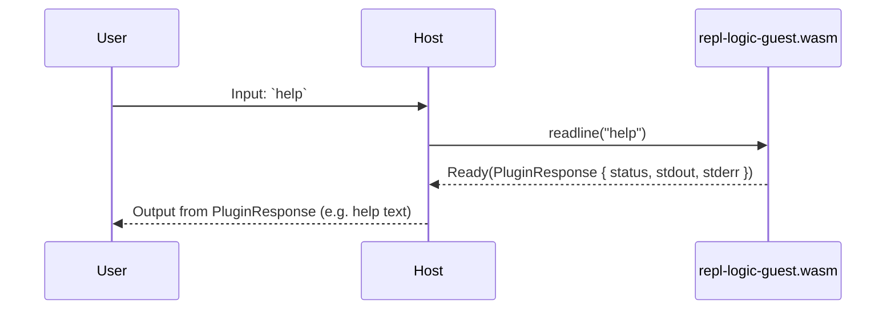
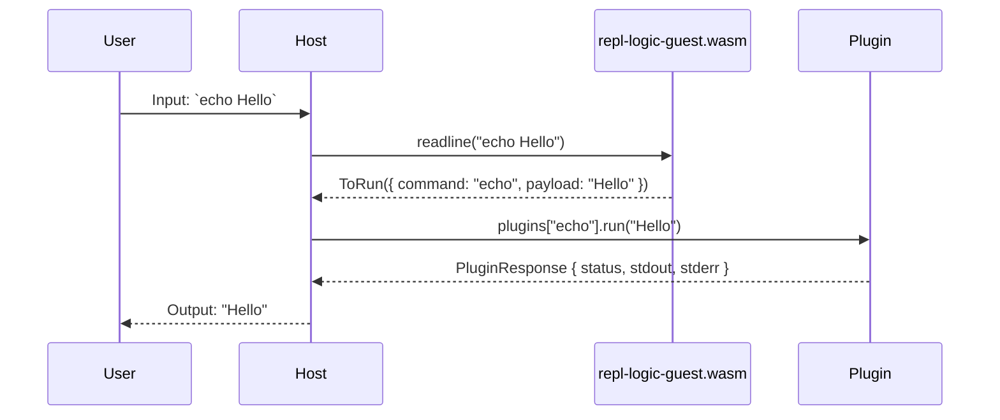
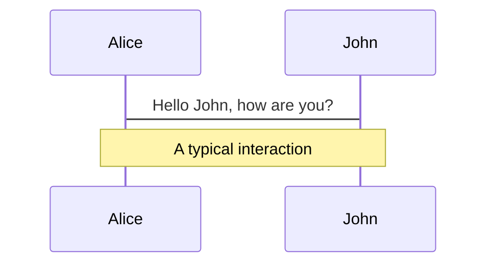
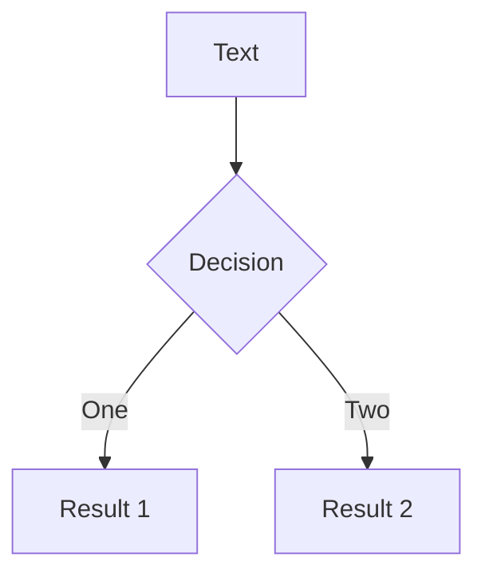
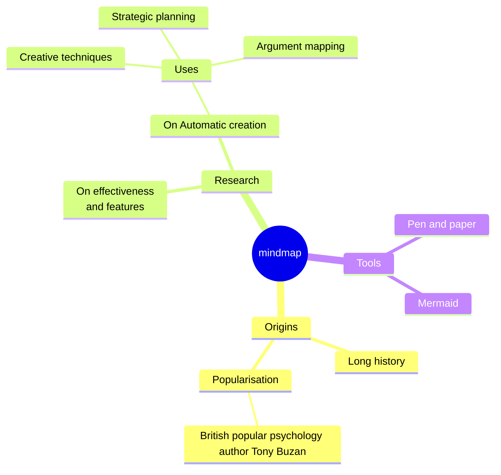
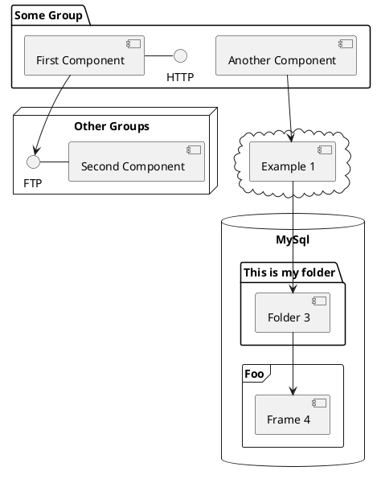

---
# You can also start simply with 'default'
theme: apple-basic
# random image from a curated Unsplash collection by Anthony
# like them? see https://unsplash.com/collections/94734566/slidev
background: https://cover.sli.dev
# Global CSS file
# css: style.css
# Alternative: inline global styles
# css: |
#   body { font-family: 'Inter', sans-serif; }
#   h1 { color: #2d3748; font-weight: 700; }
# some information about your slides (markdown enabled)
title: Construire un système de plugins basé sur le WebAssembly Component Model
info: |
  ## Slidev Starter Template
  Presentation slides for developers.

  Learn more at [Sli.dev](https://sli.dev)
# apply unocss classes to the current slide
class: text-center
# https://sli.dev/features/drawing
drawings:
  persist: false
# slide transition: https://sli.dev/guide/animations.html#slide-transitions
transition: slide-left
# enable MDC Syntax: https://sli.dev/features/mdc
mdc: true
# open graph
seoMeta:
  # By default, Slidev will use ./og-image.png if it exists,
  # or generate one from the first slide if not found.
  ogImage: auto
  # ogImage: https://cover.sli.dev

---

# WebAssembly Component Model 🧩

<div class="flex justify-center mb-10">
  <QRCode
    :width="300"
    :height="300"
    type="svg"
    data="https://github.com/topheman/webassembly-component-model-experiments"
    :margin="10"
    :imageOptions="{ margin: 10 }"
    :dotsOptions="{ color: '#6c63ff' }"
    image="/WebAssembly_Logo.svg"
/>
</div>

## [topheman/webassembly-component-model-experiments](https://github.com/topheman/webassembly-component-model-experiments)

---
layout: center
class: text-center
---

# 🎯 Pourquoi ce projet ?

<v-click>
<p><strong>Problème</strong> : Exemples de projets avec WebAssembly Component Model <strong>trop simples</strong> ou <strong>trop complexes</strong></p>
</v-click>
<v-click>
<p><strong>Objectif</strong> : Démontrer la puissance de WCM avec une application concrète</p>
</v-click>
<v-click>
<p><strong>Réalisation</strong> : Un REPL modulaire où chaque commande est un composant Wasm</p>
</v-click>
<v-click>
<p><strong>Contrainte</strong> : Le même code doit fonctionner sur 🛠️ CLI et 🌐 navigateur</p>
</v-click>
---
layout: center
class: text-center
---

# 🚀 Ce que nous allons couvrir

1. **Introduction au WebAssembly Component Model**
2. **Démo du projet**
3. **Architecture du projet**

---
layout: center
class: text-center
---

# ⚔️ Ce que nous n'allons pas couvrir

- **Détails d'implémentation de chaque langage**
- **Tooling spécifique à chaque langage**

---
layout: center
class: text-center
---

# 🔄 L'évolution de WebAssembly

## WebAssembly → WASI → Component Model

- **2017** : WebAssembly MVP - format binaire bas niveau, portable et sécurisé
- **WASI** : WebAssembly System Interface
- **Component Model** : Composition, interfaces, sandboxing

---

# 🧩 WebAssembly Component Model

## Concepts clés

- **WIT (WebAssembly Interface Types)** : Définir des contrats entre composants
- **Composants** : Unités réutilisables et sandboxées
- **Composabilité** : Construire des systèmes à partir de composants Wasm

---

# 🎬 Démo en direct :

- 🛠️ Version CLI
- 🌐 Version navigateur

---

# 🎬 Démo en direct :

## Fonctionnalités :

- Commandes de base (`echo`, `ls`, `cat`)
- Chargement et exécution de plugins
- Compatibilité multi-langages
- Fonctionnalités de sécurité

---

# 🔍 Comment cela fonctionne

## Vue d'ensemble

- 🏠 **Host Runtime**
  - 🔧 CLI (`pluginlab` rust + wasmtime)
  - 🌐 Web (TypeScript + `jco` tranpilation of the components + browser runtime)
- 🧩 **Composants Wasm**
  - REPL Logic
  - Plugins

---

# 🏠 Host Runtime : CLI 🔧

### CLI Host (Rust + wasmtime)
- **Runtime** : wasmtime avec support natif WCM
- **Responsabilités** : Chargement de plugins, sandboxing filesystem, contrôle réseau
- **Fonctionnalités** :
  - Runtime async (basé sur `tokio`)
  - security policies (basé sur `wasmtime`)
  - chargement de plugins HTTP (basé sur `reqwest`)

---

# 🏠 Host Runtime : Web 🌐

### Browser Host (TypeScript + jco)
- **Preparation des composants** : `jco transpile`
  - Browser ne supporte pas nativement les composants Wasm
  - Wasm Components → Wasm Modules + glue code
- **Runtime** : moteur JavaScript
- **Responsabilités** : Filesystem virtuel, transpilation de composants
- **Fonctionnalités** :
  - Filesystem en mémoire
  - client HTTP synchrone (basé sur `XMLHttpRequest`)

---

# 🧩 Composants Wasm : REPL Logic

## REPL Logic (`repl-logic-guest.wasm`)
- **Objectif** : Orchestrer l'entrée utilisateur et le dispatch de plugins
- **Responsabilités** :
  - Variable expansion (`export VAR=value`)
  - Reserved commands handling (`help`, `man`)
  - Dispatch de plugins (appel du plugin approprié)
- **Réutilisation du code entre CLI et navigateur**

---

# 🧩 Composants Wasm : Plugins

## Plugins (`plugin*.wasm`)
- **Objectif** : Exécuter des commandes spécifiques (`echo`, `ls`, `cat`, `tee`)
- **Langages** : Rust, C, Go, TypeScript
- **Interface** : Tous implémentent le même contrat WIT

---

# 🧩 Host + Guest

## Comment ils se connectent
- **Host** fournit le runtime et les limites de sécurité
- **REPL Logic** orchestre le flux
- **Plugins** s'exécutent dans l'environnement sandboxé

---

# 🌐 Même code, différents hôtes

## Pourquoi c'est possible
- **WebAssembly Component Model** avec les contrats WIT définit le protocole de communication
- **Host implementations** gèrent les détails spécifiques à l'environnement

## WebAssembly Interface Types →

---

# 🎭 WIT : WebAssembly Interface Types

```wit
package repl:api;

interface plugin {
  enum repl-status { success, error }

  record plugin-response {
    status: repl-status,
    stdout: option<string>,
    stderr: option<string>,
  }

  name: func() -> string;
  man: func() -> string;
  run: func(payload: string) -> result<plugin-response>;
}

interface http-client {
  record http-header { name: string, value: string }

  record http-response {
    status: u16,
    ok: bool,
    headers: list<http-header>,
    body: string,
  }

  get: func(url: string, headers: list<http-header>) -> result<http-response, string>;
}

world plugin-api {
  import http-client;
  export plugin;
}
```

**Separation of concerns** : Les plugins ne connaissent pas l'environnement host

---

# [Implémentation d'un plugin](https://github.com/topheman/webassembly-component-model-experiments/blob/master/crates/plugin-echo/src/lib.rs):

```rust
mod bindings;
use crate::bindings::exports::repl::api::plugin::{Guest, PluginResponse, ReplStatus};

struct Component;

impl Guest for Component {
  fn name() -> String { "echo".to_string() }
  fn man() -> String { "Some man page".to_string() }
  fn run(payload: String) -> Result<PluginResponse, ()> {
    Ok(PluginResponse {
      status: ReplStatus::Success,
      stdout: Some(payload),
      stderr: None,
    })
  }
}

bindings::export!(Component with_types_in bindings);
```

---

# 🔄 Traitement des commandes

## Comment les commandes sont traitées

- **Commandes réservées** (`help`, `man`) → REPL Logic gère directement
- **Commandes de plugins** (`echo`, `ls`) → REPL Logic dispatch vers les plugins

## Deux chemins différents
- **Exécution directe** pour les commandes intégrées
- **Dispatch de plugins** pour les commandes externes

---

# 🔄 Flux des commandes réservées

## Comment fonctionne la commande `help`



**Exécution directe** : REPL logic gère les commandes réservées en interne

---

# 🔄 Flux des commandes de plugins

## Comment fonctionne la commande `echo Hello`



**Dispatch de plugins** : REPL logic route vers le plugin approprié pour l'exécution

---

# 🔒 Sécurité et Sandboxing

## Sandboxing par défaut

Les runtimes WebAssembly sont sandboxés par défaut :

- **Isolation complète** - Pas d'accès direct au système
- **Contrôle granulaire** - L'host décide des permissions
- **Sécurité native** - Pas de vulnérabilités de mémoire
- **Cross-platform** - Même modèle de sécurité partout

## Deux environnements, deux approches

- **CLI** : Contrôle explicite via flags
- **Web** : Filesystem virtuel + APIs limitées

---

# 🔒 Sécurité et Sandboxing - CLI 🔧

## Contrôle du filesystem
```bash
--allow-read /path/to/data
--allow-write /path/to/output
--dir /data:/mnt/data
```

## Accès réseau
```bash
--allow-net
--allow-net=example.com
```

**Les plugins ne peuvent accéder qu'à ce que vous autorisez !**

---

# 🔒 Sécurité et Sandboxing - Web 🌐

## 🔧 Shim WASI Filesystem

## Le challenge
- Les navigateurs n'ont pas accès au filesystem réel
- Les plugins comme `tee` ont besoin d'écrire des fichiers
- Le `@bytecodealliance/preview2-shim` standard ne supporte pas les opérations WRITE

## La solution
- **Fork du shim** pour ajouter le support WRITE approprié
- **Filesystem virtuel** monté au runtime avec des données JSON
- **Transparent pour les plugins** - ils utilisent les APIs `wasi:filesystem` standard

## Résultat
- Le plugin `tee` fonctionne dans le navigateur ! 🎉
- Le même code filesystem fonctionne sur CLI et web
- Aucune modification de plugin nécessaire

---

# 🌍 Support multi-langages pour les plugins

| Langage | Taille | Notes |
|---------|--------|-------|
| **C** | 56K | WASI SDK, runtime minimal |
| **Rust** | 72K | cargo-component, sécurité |
| **Go** | 332K | TinyGo, runtime plus large |
| **TypeScript** | 12M | Moteur JavaScript intégré |

**Même interface, implémentations différentes !**

---

# 🎯 Points clés

## WebAssembly Component Model est prêt
- **APIs stables** (Preview 2)
- **Applications réelles** possibles
- **Support multi-langages** fonctionnel
- **Sécurité** intégrée

## Permet de nouveaux patterns
- Systèmes de plugins
- Middleware serverless
- Partage de logique cross-platform
- Exécution de code sandboxée

---

# 🚀 Et après ?

## Ce projet comme fondation
- **Playground** pour tester de nouvelles fonctionnalités WCM
- **Plateforme** pour expérimenter avec d'autres langages
- **Fondation** pour des projets plus complexes

## Futures fonctionnalités WCM
- **Preview 3** : Async, streaming
- **Meilleurs outils** et support de langages
- **Plus d'environnements host**

---

# 🔗 Ressources et démo

## Essayez par vous-même
- **Démo en ligne** : [topheman.github.io/webassembly-component-model-experiments](https://topheman.github.io/webassembly-component-model-experiments)
- **GitHub** : [github.com/topheman/webassembly-component-model-experiments](https://github.com/topheman/webassembly-component-model-experiments)
- **Démo CLI** : [asciinema.org/a/DWYAgrjSpwlejvRJQY8AHCEfD](https://asciinema.org/a/DWYAgrjSpwlejvRJQY8AHCEfD)

## Questions et discussion
**Que construiriez-vous avec le WebAssembly Component Model ?**

---

# 🎉 Merci !

## Contact
- **GitHub** : [@topheman](https://github.com/topheman)
- **Twitter** : [@topheman](https://twitter.com/topheman)
- **Blog** : [topheman.github.io](https://topheman.github.io)

**Construisons ensemble l'avenir de WebAssembly ! 🚀**

---

# Welcome to Slidev

Presentation slides for developers

<div @click="$slidev.nav.next" class="mt-12 py-1" hover:bg="white op-10">
  Press Space for next page <carbon:arrow-right />
</div>

<div class="abs-br m-6 text-xl">
  <button @click="$slidev.nav.openInEditor()" title="Open in Editor" class="slidev-icon-btn">
    <carbon:edit />
  </button>
  <a href="https://github.com/slidevjs/slidev" target="_blank" class="slidev-icon-btn">
    <carbon:logo-github />
  </a>
</div>

<!--
The last comment block of each slide will be treated as slide notes. It will be visible and editable in Presenter Mode along with the slide. [Read more in the docs](https://sli.dev/guide/syntax.html#notes)
-->

---
transition: fade-out
---

# What is Slidev?

Slidev is a slides maker and presenter designed for developers, consist of the following features

- 📝 **Text-based** - focus on the content with Markdown, and then style them later
- 🎨 **Themable** - themes can be shared and re-used as npm packages
- 🧑‍💻 **Developer Friendly** - code highlighting, live coding with autocompletion
- 🤹 **Interactive** - embed Vue components to enhance your expressions
- 🎥 **Recording** - built-in recording and camera view
- 📤 **Portable** - export to PDF, PPTX, PNGs, or even a hostable SPA
- 🛠 **Hackable** - virtually anything that's possible on a webpage is possible in Slidev
<br>
<br>

Read more about [Why Slidev?](https://sli.dev/guide/why)

<!--
You can have `style` tag in markdown to override the style for the current page.
Learn more: https://sli.dev/features/slide-scope-style
-->

<style>
h1 {
  background-color: #2B90B6;
  background-image: linear-gradient(45deg, #4EC5D4 10%, #146b8c 20%);
  background-size: 100%;
  -webkit-background-clip: text;
  -moz-background-clip: text;
  -webkit-text-fill-color: transparent;
  -moz-text-fill-color: transparent;
}
</style>

<!--
Here is another comment.
-->

---
transition: slide-up
level: 2
---

# Navigation

Hover on the bottom-left corner to see the navigation's controls panel, [learn more](https://sli.dev/guide/ui#navigation-bar)

## Keyboard Shortcuts

|                                                     |                             |
| --------------------------------------------------- | --------------------------- |
| <kbd>right</kbd> / <kbd>space</kbd>                 | next animation or slide     |
| <kbd>left</kbd>  / <kbd>shift</kbd><kbd>space</kbd> | previous animation or slide |
| <kbd>up</kbd>                                       | previous slide              |
| <kbd>down</kbd>                                     | next slide                  |

<!-- https://sli.dev/guide/animations.html#click-animation -->

<p v-after class="absolute bottom-23 left-45 opacity-30 transform -rotate-10">Here!</p>

---
layout: two-cols
layoutClass: gap-16
---

# Table of contents

You can use the `Toc` component to generate a table of contents for your slides:

```html
<Toc minDepth="1" maxDepth="1" />
```

The title will be inferred from your slide content, or you can override it with `title` and `level` in your frontmatter.

::right::

<Toc text-sm minDepth="1" maxDepth="2" />

---
layout: image-right
image: https://cover.sli.dev
---

# Code

Use code snippets and get the highlighting directly, and even types hover!

```ts [filename-example.ts] {all|4|6|6-7|9|all} twoslash
// TwoSlash enables TypeScript hover information
// and errors in markdown code blocks
// More at https://shiki.style/packages/twoslash
import { computed, ref } from 'vue'

const count = ref(0)
const doubled = computed(() => count.value * 2)

doubled.value = 2
```

<arrow v-click="[4, 5]" x1="350" y1="310" x2="195" y2="342" color="#953" width="2" arrowSize="1" />

<!-- This allow you to embed external code blocks -->
<<< @/snippets/external.ts#snippet

<!-- Footer -->

[Learn more](https://sli.dev/features/line-highlighting)

<!-- Inline style -->
<style>
.footnotes-sep {
  @apply mt-5 opacity-10;
}
.footnotes {
  @apply text-sm opacity-75;
}
.footnote-backref {
  display: none;
}
</style>

<!--
Notes can also sync with clicks

[click] This will be highlighted after the first click

[click] Highlighted with `count = ref(0)`

[click:3] Last click (skip two clicks)
-->

---
level: 2
---

# Shiki Magic Move

Powered by [shiki-magic-move](https://shiki-magic-move.netlify.app/), Slidev supports animations across multiple code snippets.

Add multiple code blocks and wrap them with <code>````md magic-move</code> (four backticks) to enable the magic move. For example:

````md magic-move {lines: true}
```ts {*|2|*}
// step 1
const author = reactive({
  name: 'John Doe',
  books: [
    'Vue 2 - Advanced Guide',
    'Vue 3 - Basic Guide',
    'Vue 4 - The Mystery'
  ]
})
```

```ts {*|1-2|3-4|3-4,8}
// step 2
export default {
  data() {
    return {
      author: {
        name: 'John Doe',
        books: [
          'Vue 2 - Advanced Guide',
          'Vue 3 - Basic Guide',
          'Vue 4 - The Mystery'
        ]
      }
    }
  }
}
```

```ts
// step 3
export default {
  data: () => ({
    author: {
      name: 'John Doe',
      books: [
        'Vue 2 - Advanced Guide',
        'Vue 3 - Basic Guide',
        'Vue 4 - The Mystery'
      ]
    }
  })
}
```

Non-code blocks are ignored.

```vue
<!-- step 4 -->
<script setup>
const author = {
  name: 'John Doe',
  books: [
    'Vue 2 - Advanced Guide',
    'Vue 3 - Basic Guide',
    'Vue 4 - The Mystery'
  ]
}
</script>
```
````

---

# Components

<div grid="~ cols-2 gap-4">
<div>

You can use Vue components directly inside your slides.

We have provided a few built-in components like `<Tweet/>` and `<Youtube/>` that you can use directly. And adding your custom components is also super easy.

```html
<Counter :count="10" />
```

<!-- ./components/Counter.vue -->
<Counter :count="10" m="t-4" />

Check out [the guides](https://sli.dev/builtin/components.html) for more.

</div>
<div>

```html
<Tweet id="1390115482657726468" />
```

<Tweet id="1390115482657726468" scale="0.65" />

</div>
</div>

<!--
Presenter note with **bold**, *italic*, and ~~striked~~ text.

Also, HTML elements are valid:
<div class="flex w-full">
  <span style="flex-grow: 1;">Left content</span>
  <span>Right content</span>
</div>
-->

---
class: px-20
---

# Themes

Slidev comes with powerful theming support. Themes can provide styles, layouts, components, or even configurations for tools. Switching between themes by just **one edit** in your frontmatter:

<div grid="~ cols-2 gap-2" m="t-2">

```yaml
---
theme: default
---
```

```yaml
---
theme: seriph
---
```


</div>

Read more about [How to use a theme](https://sli.dev/guide/theme-addon#use-theme) and
check out the [Awesome Themes Gallery](https://sli.dev/resources/theme-gallery).

---

# Clicks Animations

You can add `v-click` to elements to add a click animation.

<div v-click>

This shows up when you click the slide:

```html
<div v-click>This shows up when you click the slide.</div>
```

</div>

<br>

<v-click>

The <span v-mark.red="3"><code>v-mark</code> directive</span>
also allows you to add
<span v-mark.circle.orange="4">inline marks</span>
, powered by [Rough Notation](https://roughnotation.com/):

```html
<span v-mark.underline.orange>inline markers</span>
```

</v-click>

<div mt-20 v-click>

[Learn more](https://sli.dev/guide/animations#click-animation)

</div>

---

# Motions

Motion animations are powered by [@vueuse/motion](https://motion.vueuse.org/), triggered by `v-motion` directive.

```html
<div
  v-motion
  :initial="{ x: -80 }"
  :enter="{ x: 0 }"
  :click-3="{ x: 80 }"
  :leave="{ x: 1000 }"
>
  Slidev
</div>
```

<div class="w-60 relative">
  <div class="relative w-40 h-40">
    
    
    
  </div>

  <div
    class="text-5xl absolute top-14 left-40 text-[#2B90B6] -z-1"
    v-motion
    :initial="{ x: -80, opacity: 0}"
    :enter="{ x: 0, opacity: 1, transition: { delay: 2000, duration: 1000 } }">
    Slidev
  </div>
</div>

<!-- vue script setup scripts can be directly used in markdown, and will only affects current page -->
<script setup lang="ts">
const final = {
  x: 0,
  y: 0,
  rotate: 0,
  scale: 1,
  transition: {
    type: 'spring',
    damping: 10,
    stiffness: 20,
    mass: 2
  }
}
</script>

<div
  v-motion
  :initial="{ x:35, y: 30, opacity: 0}"
  :enter="{ y: 0, opacity: 1, transition: { delay: 3500 } }">

[Learn more](https://sli.dev/guide/animations.html#motion)

</div>

---

# LaTeX

LaTeX is supported out-of-box. Powered by [KaTeX](https://katex.org/).

<div h-3 />

Inline $\sqrt{3x-1}+(1+x)^2$

Block
$$ {1|3|all}
\begin{aligned}
\nabla \cdot \vec{E} &= \frac{\rho}{\varepsilon_0} \\
\nabla \cdot \vec{B} &= 0 \\
\nabla \times \vec{E} &= -\frac{\partial\vec{B}}{\partial t} \\
\nabla \times \vec{B} &= \mu_0\vec{J} + \mu_0\varepsilon_0\frac{\partial\vec{E}}{\partial t}
\end{aligned}
$$

[Learn more](https://sli.dev/features/latex)

---

# Diagrams

You can create diagrams / graphs from textual descriptions, directly in your Markdown.

<div class="grid grid-cols-4 gap-5 pt-4 -mb-6">









</div>

Learn more: [Mermaid Diagrams](https://sli.dev/features/mermaid) and [PlantUML Diagrams](https://sli.dev/features/plantuml)

---
foo: bar
dragPos:
  square: 691,32,167,_,-16
---

# Draggable Elements

Double-click on the draggable elements to edit their positions.

<br>

###### Directive Usage

```md

```

<br>

###### Component Usage

```md
<v-drag text-3xl>
  <div class="i-carbon:arrow-up" />
  Use the `v-drag` component to have a draggable container!
</v-drag>
```

<v-drag pos="663,206,261,_,-15">
  <div text-center text-3xl border border-main rounded>
    Double-click me!
  </div>
</v-drag>


###### Draggable Arrow

```md
<v-drag-arrow two-way />
```

<v-drag-arrow pos="67,452,253,46" two-way op70 />

---
src: ./pages/imported-slides.md
hide: false
---

---

# Monaco Editor

Slidev provides built-in Monaco Editor support.

Add `{monaco}` to the code block to turn it into an editor:

```ts {monaco}
import { ref } from 'vue'
import { emptyArray } from './external'

const arr = ref(emptyArray(10))
```

Use `{monaco-run}` to create an editor that can execute the code directly in the slide:

```ts {monaco-run}
import { version } from 'vue'
import { emptyArray, sayHello } from './external'

sayHello()
console.log(`vue ${version}`)
console.log(emptyArray<number>(10).reduce(fib => [...fib, fib.at(-1)! + fib.at(-2)!], [1, 1]))
```

---
layout: center
class: text-center
---

# Learn More

[Documentation](https://sli.dev) · [GitHub](https://github.com/slidevjs/slidev) · [Showcases](https://sli.dev/resources/showcases)

<PoweredBySlidev mt-10 />
